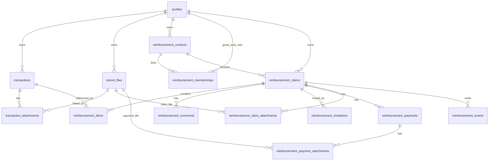

# Financy Ressarcimentos - Plano Tecnico Revisado

## 1. Resumo executivo atualizado

O modulo **Financy Ressarcimentos** deve ser implementado dentro do Financy atual, como um dominio proprio, sem criar uma arquitetura paralela. O titular continua sendo o dono dos dados financeiros, e pessoas convidadas acessam apenas cobrancas explicitamente compartilhadas.

Esta revisao ajusta o plano anterior para reduzir ambiguidades antes da implementacao:

- convidados devem usar **Supabase Auth**; convite nao e sessao permanente;
- arquivos devem usar uma fundacao reutilizavel de storage privado antes do modulo de ressarcimentos;
- anexos devem ser modelados com uma tabela fisica central de arquivos e tabelas de relacionamento por dominio;
- pagamentos informados por convidados devem exigir confirmacao do owner;
- status de cobranca deve ser simples e comandado por endpoints de acao, nao por PATCH livre;
- Telegram, OCR, audio, inbox inteligente e deduplicacao avancada ficam fora do primeiro MVP.

Este documento e de planejamento. Ele nao implementa codigo, nao cria migrations executaveis, nao altera APIs e nao inicia integracoes externas.

## 2. Escopo exato do MVP

### Owner

- Cadastrar, editar e inativar contatos de ressarcimento.
- Anexar comprovante a transacao usando infraestrutura privada de arquivos.
- Marcar valor integral ou parcial de uma transacao como ressarcivel.
- Criar cobranca em `draft`.
- Adicionar e remover itens enquanto a cobranca esta em `draft`.
- Revisar total calculado.
- Enviar cobranca.
- Visualizar status, historico e eventos.
- Comentar em cobrancas.
- Visualizar contestacao do convidado.
- Confirmar ou rejeitar pagamento informado.
- Cancelar cobranca conforme regras de status.

### Convidado

- Autenticar ou criar conta via Supabase Auth.
- Aceitar convite valido, expiravel, consumivel e revogavel.
- Visualizar somente cobrancas autorizadas pelo membership.
- Visualizar snapshots dos itens compartilhados.
- Abrir comprovantes autorizados via signed URL curta.
- Reconhecer cobranca.
- Contestar com motivo/comentario.
- Informar pagamento com valor, data, metodo, observacao e comprovante opcional.
- Acompanhar se o pagamento foi confirmado ou rejeitado pelo owner.

## 3. Nao escopo do primeiro MVP

- Telegram.
- Inbox inteligente.
- OCR.
- Audio/transcricao.
- IA para interpretar mensagens ou documentos.
- Deduplicacao Telegram/importacao.
- Gateway de pagamento.
- Pix automatico.
- Link de pagamento.
- Open Finance.
- Rateio avancado.
- Multiplos responsaveis no mesmo item pela UI.
- Notificacoes complexas.
- Lembretes recorrentes.
- Integracao WhatsApp.
- Integracoes corporativas.

## 4. Decisoes arquiteturais revisadas

- O modulo permanece no monolito atual FastAPI/Next.js, seguindo os padroes existentes de routers, services, repositories, schemas Pydantic e client API central.
- `owner_user_id` sempre vem da sessao no backend. O frontend nunca envia nem escolhe owner.
- O acesso de guest depende de Supabase Auth + membership valido. Convite apenas autoriza o aceite do relacionamento.
- Cobrancas usam status de dominio e endpoints de acao para transicoes sensiveis.
- Totais oficiais sao calculados a partir de itens ativos e pagamentos confirmados; snapshots preservam o que foi enviado.
- Arquivos usam storage privado com signed URLs geradas pelo backend.
- RLS deve ser defesa adicional; a autorizacao primaria continua obrigatoria no backend.
- A primeira implementacao deve ser dividida por fundacoes tecnicas, com **Fundacao 0 - Storage privado e infraestrutura de arquivos** antes de qualquer portal ou comprovante compartilhado.

## 5. Autenticacao de convidados

Decisao: **o token de convite autoriza o aceite do relacionamento, mas nao substitui uma sessao autenticada**.

Fluxo recomendado:

1. Owner cria ou seleciona um contato.
2. Owner envia convite para o e-mail do contato.
3. Convidado abre o link.
4. Frontend exige login ou cadastro via Supabase Auth.
5. Backend valida token, expiracao, revogacao e e-mail esperado.
6. Backend cria `reimbursement_membership`.
7. Convite e marcado como aceito/consumido.
8. Convidado acessa apenas cobrancas autorizadas por membership.

Casos obrigatorios:

- Convidado ja possui conta Supabase: pode aceitar apos login, se e-mail bater com o convite ou a politica permitir excecao revisada pelo owner.
- Convidado nao possui conta: deve criar conta via Supabase Auth antes do aceite.
- Convite aberto no navegador errado: link continua valido ate expirar, mas aceite exige sessao do e-mail correto.
- E-mail autenticado diferente do e-mail convidado: negar por padrao com erro generico; excecao exigiria novo convite.
- Convite expirado, revogado ou ja aceito: negar sem revelar detalhes enumeraveis.
- Aceite duplicado: retornar estado ja aceito se for o mesmo usuario autenticado, sem criar membership duplicado.
- Owner cancelando acesso: inativar membership; acesso deve cessar imediatamente.
- Mesmo convidado com varios owners: permitido; cada membership e isolado por owner.

## 6. Contatos e memberships

`reimbursement_contacts` representa uma pessoa no contexto de um owner e pode existir sem login. `reimbursement_memberships` representa o vinculo entre esse contato e um usuario autenticado Supabase.

Regras:

- Um contato pertence a exatamente um owner.
- Um contato pode nao ter membership.
- Um usuario autenticado pode ter memberships com owners diferentes.
- O owner nunca escolhe `auth_user_id` pelo frontend; o backend deriva do usuario autenticado no aceite do convite.
- Dentro de um mesmo owner, um contato ativo nao deve ser vinculado a dois usuarios autenticados diferentes.
- Membership duplicado deve ser prevenido por constraint e regra de service.

Constraints recomendadas:

- `reimbursement_contacts(owner_user_id, lower(trim(display_name))) where status='active'` para evitar duplicidade visual.
- `reimbursement_memberships(owner_user_id, contact_id) where status='active'` para impedir dois usuarios no mesmo contato ativo.
- `reimbursement_memberships(owner_user_id, auth_user_id) where status='active'` pode ser usada se o produto decidir que o mesmo guest nao deve aparecer como dois contatos distintos para o mesmo owner.

Trade-off: permitir varios contatos para o mesmo `auth_user_id` no mesmo owner ajuda em casos familiares complexos, mas aumenta risco de duplicidade e confusao. Recomendacao provisoria: bloquear `owner_user_id + auth_user_id` ativo duplicado e permitir excecao futura somente se houver caso real.

## 7. Modelo de arquivos

Nao usar uma unica tabela polimorfica `entity_type/entity_id` para anexos, porque isso reduz integridade referencial. A arquitetura recomendada e:

### Tabela fisica central

`stored_files`

Responsavel por:

- `id`;
- `owner_user_id`;
- `storage_bucket`;
- `storage_path`;
- `original_filename`;
- `declared_mime_type`;
- `detected_mime_type`;
- `size_bytes`;
- `sha256_hash`;
- `source`;
- `status`: `uploaded`, `quarantined`, `available`, `rejected`, `deleted`;
- `scan_status`: `pending`, `clean`, `suspicious`, `failed`, `skipped`;
- `created_at`;
- `deleted_at`;
- metadata segura e redigida.

### Relacionamentos especificos

MVP:

- `transaction_attachments`: transacao -> arquivo.
- `reimbursement_claim_attachments`: cobranca -> arquivo, para evidencias gerais.
- `reimbursement_payment_attachments`: pagamento informado -> arquivo.

Futuro:

- `inbox_attachments`;
- `reimbursement_comment_attachments`, somente se comentarios com anexos forem validados como necessidade real.

Regras:

- Storage path nunca e exposto diretamente.
- Signed URL e gerada pelo backend apos autorizacao por dominio.
- Guest so recebe signed URL se o arquivo estiver ligado a uma cobranca acessivel por membership.
- Cada emissao de URL sensivel deve gerar evento.
- URLs devem ter validade curta.
- Arquivos repetidos podem reaproveitar hash, mas cada associacao de dominio deve ser explicita.

## 8. Storage privado

Fundacao obrigatoria antes do modulo:

- Adapter de Supabase Storage privado.
- Tabela `stored_files`.
- Upload seguro.
- Validacao de extensao.
- Validacao de MIME declarado.
- Validacao por magic bytes.
- Limite inicial de 10 MB por arquivo.
- Tipos permitidos no MVP: JPEG, PNG, WebP e PDF.
- Hash SHA-256.
- Quarentena e status de scan.
- Signed URLs.
- Autorizacao no backend.
- Soft delete.
- Exclusao fisica posterior por job.
- Eventos de auditoria do dominio.
- Testes de isolamento owner/guest.

Essa fundacao deve ser reutilizavel por importacao, transacoes, ressarcimentos e futuras integracoes. Ela deve vir antes de portal de convidados, comprovantes em cobrancas, Telegram, OCR e audio porque todos esses fluxos exporiam ou processariam arquivos sensiveis.

Decisoes de fechamento da Fundacao 0:

- O contrato publico de arquivo nao deve expor `storage_path` nem `storage_bucket`; esses campos ficam restritos ao backend.
- O provider local usa URL temporaria do backend com token HMAC; o provider Supabase deve usar signed URL do Storage.
- `PRIVATE_FILES_SCAN_PROVIDER=mock` so libera arquivo automaticamente em `local`, `development` ou `test`.
- Em producao, enquanto nao houver scanner real configurado, uploads ficam `quarantined/pending` e nao geram signed URL.
- Signed URL so pode ser gerada para `status=available` e `scan_status=clean|skipped`.
- Arquivos `suspicious`, `rejected`, `deleted`, `quarantined` ou com scan `failed/pending` devem ficar indisponiveis.
- Arquivos sem vinculo apos `PRIVATE_FILES_ORPHAN_RETENTION_HOURS` sao identificaveis por metodo de repository/service para futura limpeza segura.
- SHA-256 e calculado no backend e pode apoiar idempotencia/alerta, mas nunca substitui autorizacao por owner.
- Falha de storage antes do insert nao cria metadata; falha de banco apos upload aciona remocao compensatoria do objeto quando possivel.

Limites configuraveis:

- 10 MB por arquivo no MVP.
- Maximo de anexos por transacao: questao aberta; recomendacao provisoria 10.
- Maximo por cobranca: questao aberta; recomendacao provisoria 20.
- Quota total por usuario: questao aberta.
- Compressao, thumbnail e PDF multipagina ficam como evolucao.

## 9. Dominio de ressarcimentos

Entidades centrais:

- `reimbursement_contacts`;
- `reimbursement_memberships`;
- `reimbursement_claims`;
- `reimbursement_items`;
- `reimbursement_comments`;
- `reimbursement_invitations`;
- `reimbursement_payments`;
- `reimbursement_events`.

O dominio nao altera o significado de `transactions.status`. Uma transacao pode estar confirmada/paga no cartao e ainda estar pendente de ressarcimento.

## 10. Snapshots

Cada item deve preservar snapshot com:

- descricao exibida;
- valor original da transacao;
- `amount_requested`;
- data;
- categoria;
- estabelecimento/descricao normalizada, se existir;
- moeda;
- origem visual segura, sem expor dados de conta/cartao sensiveis;
- ids internos necessarios para rastreabilidade do owner;
- versao do snapshot.

Decisao:

- Em `draft`, snapshot pode ser recalculado quando a transacao muda ou quando o owner aciona atualizacao.
- Ao enviar a cobranca, snapshot torna-se imutavel.
- Mudancas posteriores na transacao original nao alteram silenciosamente a cobranca enviada.
- Correcoes em cobranca enviada devem gerar evento e, se alterarem valor ou itens, criar nova versao ou cancelamento/substituicao.
- Comprovantes adicionados depois do envio nao devem aparecer automaticamente para guest sem acao explicita do owner.

## 11. Maquina de estados da cobranca

Status principais:

- `draft`;
- `sent`;
- `acknowledged`;
- `disputed`;
- `partially_paid`;
- `paid`;
- `canceled`.

Nao usar `viewed` como status. Visualizacao deve ser representada por:

- `first_viewed_at`;
- `last_viewed_at`;
- `view_count`;
- evento `claim_first_viewed`/`claim_viewed`.

Transicoes:

- `draft -> sent`: owner, ao enviar.
- `sent -> acknowledged`: guest, opcional se o MVP incluir reconhecimento.
- `sent -> disputed`: guest, com motivo.
- `acknowledged -> disputed`: guest.
- `sent/acknowledged/disputed -> partially_paid`: automatico quando ha pagamento confirmado menor que total.
- `partially_paid -> paid`: automatico quando pagamentos confirmados cobrem total.
- `sent/acknowledged/disputed/partially_paid -> canceled`: owner, com evento.
- `paid` nao volta para `draft`.
- `canceled` e terminal para cobranca; nova cobranca deve ser criada se necessario.

O frontend nao deve enviar status livremente. Deve chamar comandos como `send`, `acknowledge`, `dispute`, `cancel`, `confirm payment` e `reject payment`.

## 12. Valores parciais

Decisao para MVP:

- Cada `reimbursement_item` pertence a uma cobranca.
- Uma transacao pode ter mais de um item de ressarcimento.
- Cada item tem `amount_requested`.
- UI inicial oferece valor integral ou parcial manual.
- Rateio avancado entre varias pessoas fica fora da primeira UI.
- O banco deve permitir evolucao futura sem expor essa complexidade.

Regra obrigatoria:

> A soma dos `amount_requested` de itens ativos, nao cancelados, associados a uma transacao nao pode ultrapassar o valor ressarcivel da transacao.

Valor ressarcivel:

- Apenas transacoes de despesa (`expense`) devem ser ressarciveis no MVP.
- Valor ressarcivel e `abs(transaction.amount)` para despesas.
- Receitas, transferencias, pagamentos e estornos nao entram no MVP sem regra explicita.
- Moeda inicial: BRL, decimal `numeric(14,2)`.
- Arredondamento sempre em centavos.
- Itens cancelados nao consomem saldo ressarcivel.
- Itens em cobrancas `draft` tambem devem consumir saldo para evitar duplicidade antes do envio.
- Validacao deve ocorrer no backend e em transacao de banco.
- Para Postgres, usar transacao com lock das linhas de itens/transacao ou isolamento adequado para impedir race condition.

## 13. Pagamentos informados e confirmados

Convidado nao pode declarar unilateralmente uma cobranca como paga.

Fluxo:

1. Guest informa pagamento.
2. Informa valor.
3. Informa data.
4. Informa metodo.
5. Adiciona observacao.
6. Pode anexar comprovante.
7. Pagamento fica `reported`.
8. Owner revisa.
9. Owner confirma ou rejeita.
10. Somente pagamento `confirmed` reduz saldo pendente oficial.

Status de pagamento:

- `reported`;
- `confirmed`;
- `rejected`;
- `canceled`.

Campos:

- `reported_by_user_id`;
- `confirmed_by_user_id`;
- `reported_at`;
- `confirmed_at`;
- `rejected_at`;
- `rejection_reason`;
- `amount`;
- `method`;
- `note`;
- `status`.

Permissoes:

- Guest autorizado pode informar pagamento.
- Owner pode informar pagamento diretamente como confirmado, se for uma baixa manual feita pelo titular.
- Owner pode confirmar ou rejeitar pagamento reportado.
- Guest nao pode confirmar.
- Guest pode cancelar pagamento reportado apenas se ainda nao foi confirmado/rejeitado; decisao final fica aberta.
- Frontend nunca envia `recorded_by`, `actor_type` ou `status=confirmed` livremente.

## 14. Comentarios

`reimbursement_comments` deve ter autor resolvido pelo backend:

- Owner/guest: `author_user_id` obrigatorio e derivado da sessao.
- System: `author_user_id` pode ser nulo.
- Guest so comenta em cobranca autorizada.
- Limite inicial: ate 2.000 caracteres.
- Soft delete.
- Sem edicao no MVP, para reduzir risco de historico inconsistente.
- Anexos em comentario ficam fora do MVP, salvo necessidade de produto validada.

## 15. Auditoria

Recomendacao revisada: usar `reimbursement_events` especifico no MVP, evoluindo para `audit_events` compartilhado depois.

Eventos minimos:

- `contact_created`;
- `claim_created`;
- `item_added`;
- `item_removed`;
- `claim_sent`;
- `invitation_created`;
- `invitation_accepted`;
- `membership_revoked`;
- `claim_first_viewed`;
- `claim_acknowledged`;
- `claim_disputed`;
- `payment_reported`;
- `payment_confirmed`;
- `payment_rejected`;
- `attachment_uploaded`;
- `attachment_url_generated`;
- `claim_canceled`.

Campos:

- actor type;
- actor user id, quando existir;
- owner;
- entity type;
- entity id;
- timestamp;
- metadata redigida;
- IP hash, quando aplicavel;
- user agent, quando necessario.

Nao armazenar:

- tokens;
- signed URLs completas;
- conteudo de comprovantes;
- dados financeiros sensiveis desnecessarios;
- payloads integrais de Telegram.

## 16. Matriz de permissoes

| Recurso | Owner | Guest autorizado | Guest nao autorizado | System worker | Usuario de outro owner |
| --- | --- | --- | --- | --- | --- |
| Contact | CRUD dentro do owner | Sem acesso direto | Sem acesso | Sem mutacao comum | Sem acesso |
| Claim | Criar, listar, ver, editar draft, enviar, cancelar | Listar/ver autorizadas, reconhecer, contestar | Sem acesso | Eventos internos | Sem acesso |
| Item | Criar/remover em draft, ver snapshots | Ver snapshots autorizados | Sem acesso | Sem mutacao comum | Sem acesso |
| Transaction snapshot | Ver e gerar para claims suas | Ver apenas snapshot compartilhado | Sem acesso | Gerar em jobs autorizados | Sem acesso |
| Stored file | Upload, associar, signed URL autorizada, soft delete | Signed URL se associado a claim autorizada | Sem acesso | Scan/exclusao fisica | Sem acesso |
| Comment | Criar/listar/soft delete proprio ou moderar | Criar/listar/soft delete proprio | Sem acesso | Criar system event/comment se necessario | Sem acesso |
| Payment | Informar, confirmar, rejeitar, cancelar conforme regra | Informar, cancelar reportado se permitido | Sem acesso | Sem mutacao financeira automatica | Sem acesso |
| Invitation | Criar, listar, revogar | Aceitar com Supabase Auth e token valido | Sem acesso | Expirar convites | Sem acesso |
| Membership | Listar/revogar | Usar para acesso proprio | Sem acesso | Criar no aceite validado | Sem acesso |
| Event | Listar no contexto owner | Ver timeline limitada da claim | Sem acesso | Criar eventos | Sem acesso |

## 17. Modelo de dados

Modelo recomendado, sem migration nesta etapa:

- `stored_files`: arquivo fisico privado.
- `transaction_attachments`: relacionamento transacao/arquivo.
- `reimbursement_claim_attachments`: relacionamento cobranca/arquivo.
- `reimbursement_payment_attachments`: relacionamento pagamento/arquivo.
- `reimbursement_contacts`: contato do owner.
- `reimbursement_memberships`: vinculo contato/auth user.
- `reimbursement_claims`: cobranca.
- `reimbursement_items`: itens com `amount_requested` e snapshot.
- `reimbursement_comments`: comentarios sem edicao no MVP.
- `reimbursement_invitations`: convites consumiveis.
- `reimbursement_payments`: pagamentos reportados/confirmados/rejeitados.
- `reimbursement_events`: auditoria especifica do dominio.

Indices obrigatorios:

- Todos os `owner_user_id`.
- Claims por `(owner_user_id, contact_id, status, due_date)`.
- Items por `(transaction_id)` e `(claim_id)`.
- Stored files por `(owner_user_id, sha256_hash)`.
- Invitations por `token_hash`.
- Memberships por owner/contact/auth user.
- Events por `(owner_user_id, entity_type, entity_id, created_at)`.

## 18. ERD atualizado

## 19. Endpoints conceituais

Os nomes devem ser adaptados ao padrao real do projeto durante implementacao.

| Endpoint | Auth/ator | Payload | Resposta | Regras |
| --- | --- | --- | --- | --- |
| `POST /files/upload` | Owner | multipart file, source | file metadata | MIME, magic bytes, tamanho, hash, quarentena, evento |
| `GET /files/{id}/signed-url` | Owner ou guest autorizado | - | URL curta | Backend autoriza por dominio e registra evento |
| `DELETE /files/{id}` | Owner | - | status | Soft delete; sem URL se deletado |
| `POST /transactions/{id}/attachments` | Owner | file_id | attachment | Transacao deve pertencer ao owner |
| `GET /transactions/{id}/attachments` | Owner | - | lista | Sem guest aqui |
| `DELETE /transactions/{id}/attachments/{attachment_id}` | Owner | - | status | Soft delete/remoção de vinculo |
| `GET /reimbursements/contacts` | Owner | - | lista | Owner derivado da sessao |
| `POST /reimbursements/contacts` | Owner | display_name, email, phone | contato | Evitar duplicidade ativa |
| `PATCH /reimbursements/contacts/{id}` | Owner | campos editaveis | contato | Se vinculado, troca de e-mail exige politica |
| `DELETE /reimbursements/contacts/{id}` | Owner | - | contato inativo | Nao apagar historico |
| `GET /reimbursements/claims` | Owner | filtros | lista | Owner only |
| `POST /reimbursements/claims` | Owner | contact_id, title, due_date | draft | Idempotency key recomendada |
| `GET /reimbursements/claims/{id}` | Owner | - | detalhe | Owner only |
| `PATCH /reimbursements/claims/{id}` | Owner | metadados draft | detalhe | Sem status livre |
| `POST /reimbursements/claims/{id}/send` | Owner | - | claim sent | Snapshot imutavel, total snapshot, convite opcional |
| `POST /reimbursements/claims/{id}/cancel` | Owner | reason | canceled | Evento; terminal |
| `POST /reimbursements/claims/{id}/items` | Owner | transaction_id, amount_requested | item | Validacao transacional de soma |
| `PATCH /reimbursements/claims/{id}/items/{item_id}` | Owner | amount_requested | item | Apenas draft; lock |
| `DELETE /reimbursements/claims/{id}/items/{item_id}` | Owner | - | removed/canceled | Draft remove; enviada cancela item/evento |
| `POST /reimbursements/invitations` | Owner | contact_id, claim_id opcional | convite | Token hash, expiracao |
| `POST /reimbursements/invitations/{id}/revoke` | Owner | - | revoked | Cessa aceite futuro |
| `POST /reimbursements/invitations/accept` | Supabase user | token | membership | E-mail correto, token consumido |
| `GET /guest/reimbursements/claims` | Guest | - | claims autorizadas | Membership ativo |
| `GET /guest/reimbursements/claims/{id}` | Guest | - | detalhe limitado | Snapshot only |
| `POST /guest/reimbursements/claims/{id}/acknowledge` | Guest | - | claim | Se transicao permitida |
| `POST /guest/reimbursements/claims/{id}/dispute` | Guest | reason/body | claim | Comentario/evento |
| `GET /reimbursements/claims/{id}/comments` | Owner/guest autorizado | - | comentarios | Escopo da claim |
| `POST /reimbursements/claims/{id}/comments` | Owner/guest autorizado | body | comentario | Autor derivado da sessao |
| `DELETE /reimbursements/claims/{id}/comments/{comment_id}` | Autor/owner | - | deleted | Soft delete |
| `POST /guest/reimbursements/claims/{id}/payments/report` | Guest | amount, date, method, note, file_id opcional | payment reported | Nao reduz saldo |
| `POST /reimbursements/claims/{id}/payments/{payment_id}/confirm` | Owner | - | payment confirmed | Atualiza status da claim |
| `POST /reimbursements/claims/{id}/payments/{payment_id}/reject` | Owner | reason | rejected | Evento/comentario opcional |

Cada endpoint sensivel deve declarar: autenticacao, papel, autorizacao, idempotencia quando aplicavel, transacao de banco, erros de dominio, evento e testes.

## 20. Fluxos owner

### Criar cobranca

1. Owner abre `Ressarcimentos`.
2. Seleciona ou cria contato.
3. Cria cobranca em `draft`.
4. Adiciona transacoes com valor integral ou parcial.
5. Backend valida soma ressarcivel.
6. Owner revisa total.
7. Owner envia.
8. Backend congela snapshots, grava `claim_sent` e cria/associa convite.

### Anexar comprovante

1. Owner abre transacao.
2. Faz upload via `POST /files/upload`.
3. Backend valida e coloca em quarentena/available conforme scan.
4. Owner associa arquivo a transacao.
5. Signed URL so e gerada sob demanda.

### Confirmar pagamento

1. Owner abre cobranca com pagamento `reported`.
2. Revisa valor, data, metodo e comprovante.
3. Confirma ou rejeita.
4. Apenas pagamentos confirmados reduzem pendencia.

## 21. Fluxos guest

### Aceitar convite

1. Guest abre link.
2. Se nao estiver autenticado, faz login/cadastro Supabase.
3. Frontend chama aceite com token.
4. Backend valida token, e-mail, status e expiracao.
5. Backend cria membership e consome convite.
6. Guest entra no portal limitado.

### Contestar

1. Guest abre cobranca autorizada.
2. Clica em contestar.
3. Informa motivo/comentario.
4. Backend muda status para `disputed` se permitido.
5. Owner ve a contestacao.

### Informar pagamento

1. Guest informa valor, data, metodo e nota.
2. Pode anexar comprovante.
3. Pagamento fica `reported`.
4. Owner confirma ou rejeita.

## 22. Retencao e LGPD

Politica inicial:

- Arquivo ativo e mantido enquanto vinculado a recurso ativo.
- Exclusao pelo usuario gera soft delete.
- Arquivo entra em periodo de retencao.
- Exclusao fisica ocorre por job posterior.
- Cobranca enviada pode bloquear exclusao direta de evidencia.
- Owner pode solicitar cancelamento/remocao conforme politica.
- Arquivos orfaos devem ser removidos por rotina.
- Signed URLs nao sao geradas para arquivos deletados.
- Guest perde acesso imediatamente apos revogacao de membership.

LGPD:

- Informar finalidade do tratamento de dados de terceiros.
- Permitir revogacao de acesso do convidado.
- Definir exportacao/exclusao de dados.
- Reduzir logs e metadata sensivel.
- Definir tratamento de backups e prazos legais/comerciais.
- Prazos juridicos de retencao permanecem questao aberta.

## 23. Estrategia de testes

### Autenticacao e convites

- Convite aceito pelo e-mail correto.
- Tentativa por e-mail diferente.
- Convite expirado.
- Convite revogado.
- Convite usado duas vezes.
- Membership revogado.
- Guest de outro owner.
- Sessao invalida.

### Arquivos

- MIME falso.
- Extensao falsa.
- Arquivo acima de 10 MB.
- Arquivo corrompido.
- Hash duplicado.
- Acesso owner.
- Acesso guest autorizado.
- Acesso guest nao autorizado.
- Signed URL expirada.
- Arquivo soft deleted.
- Storage failure.
- Rollback de metadata se upload falhar.
- Remocao de objeto se persistencia no banco falhar.

### Valores

- `amount_requested` integral.
- `amount_requested` parcial.
- Zero.
- Negativo.
- Acima da transacao.
- Soma concorrente excedendo valor.
- Item cancelado.
- Transacao editada.
- Estorno.
- Receita.
- Precisao decimal.

### Pagamentos

- Guest informa.
- Owner confirma.
- Owner rejeita.
- Guest tenta confirmar.
- Pagamento parcial.
- Soma de pagamentos acima da cobranca.
- Pagamento duplicado.
- Confirmacao concorrente.
- Comprovante de pagamento.
- Cobranca contestada.

### Snapshots

- Transacao alterada antes do envio.
- Transacao alterada depois do envio.
- Cobranca enviada preserva dados.
- Guest nao ve dados atuais nao compartilhados.

### Seguranca

- IDOR.
- Enumeracao.
- Owner A acessando owner B.
- Guest acessando dashboard.
- Guest acessando transacao original.
- Guest acessando arquivo nao compartilhado.
- Revogacao imediata.
- RLS.
- Backend sem RLS ainda bloqueia corretamente.

## 24. Ordem de implementacao

### Fundacao 0 - Storage privado e infraestrutura de arquivos

- Objetivo: criar base reutilizavel de arquivos privados.
- Dependencias: decisao Supabase Storage e configuracao de bucket privado.
- Entidades: `stored_files`, relacionamentos minimos para transacao.
- Endpoints: upload, signed URL, delete, transaction attachments.
- Frontend: componente de anexos em transacao.
- Seguranca: MIME, magic bytes, hash, tamanho, scan/quarentena.
- Testes: isolamento, arquivo invalido, signed URL.
- Aceite: owner anexa comprovante e acessa por signed URL; usuario sem permissao nao acessa.
- Rollback: desligar feature flag e manter metadados sem expor URLs.

### Fundacao 1 - Dominio de ressarcimentos

- Objetivo: contatos, cobrancas, itens, snapshots, regras de valor, status e eventos.
- Dependencias: Fundacao 0 para anexos completos, mas pode iniciar sem compartilhar arquivos.
- Entidades: contacts, claims, items, events.
- Endpoints: CRUD owner e comandos de claim.
- Frontend: ainda minimo ou mockado para teste interno.
- Seguranca: owner-only, valores transacionais.
- Testes: partial amount, IDOR, snapshots.
- Aceite: owner cria draft, adiciona itens e envia com snapshot.
- Rollback: feature flag do modulo.

### Fundacao 2 - Interface do owner

- Objetivo: experiencia principal no app.
- Dependencias: Fundacao 1.
- Frontend: menu Ressarcimentos, listagem, detalhe, criacao, acao nas transacoes, anexos.
- Testes: typecheck/lint/build/E2E owner.
- Aceite: owner opera fluxo completo sem guest.
- Rollback: ocultar menu por flag.

### Fundacao 3 - Convites e portal do convidado

- Objetivo: acesso limitado via Supabase Auth e membership.
- Dependencias: Fundacoes 0-2.
- Entidades: invitations, memberships.
- Endpoints: accept, guest claims, guest actions.
- Frontend: shell guest sem app financeiro.
- Seguranca: membership, 403/404 anti-enumeracao, revogacao imediata.
- Testes: convite, guest limitado, outro owner.
- Aceite: guest ve somente cobrancas autorizadas.
- Rollback: revogar convites e ocultar portal.

### Fundacao 4 - Pagamentos manuais

- Objetivo: pagamento reportado, confirmado/rejeitado, parcial e comprovante.
- Dependencias: Fundacao 3 e arquivos.
- Entidades: reimbursement_payments, payment attachments.
- Endpoints: report, confirm, reject.
- Seguranca: guest reporta, owner confirma.
- Testes: status, soma, concorrencia.
- Aceite: pagamento reportado nao baixa saldo ate confirmacao.
- Rollback: desativar report pelo guest; owner mantem baixa manual futura.

### Fundacao 5 - Seguranca e beta

- Objetivo: endurecimento antes de piloto.
- Dependencias: MVP funcional.
- Escopo: RLS, testes IDOR, feature flags, quotas, retencao, smoke tests, piloto fechado.
- Aceite: validacoes passam e risco residual documentado.

### Fases futuras

- Telegram texto.
- Inbox.
- Imagem/PDF.
- OCR.
- Audio.
- Deduplicacao avancada.
- Pagamentos integrados.

## 25. Criterios de aceite por fundacao

- Fundacao 0: storage privado funcional, URLs curtas autorizadas, arquivo invalido bloqueado, testes de isolamento.
- Fundacao 1: dominio cria contatos/cobrancas/itens com snapshots e regra de soma.
- Fundacao 2: owner consegue operar fluxo no app com UX responsiva.
- Fundacao 3: guest autenticado aceita convite e ve apenas o autorizado.
- Fundacao 4: pagamento reportado exige confirmacao; parcial recalcula status.
- Fundacao 5: RLS/IDOR/smoke/beta prontos e documentados.

## 26. Riscos e mitigacoes

- Convite usado por pessoa errada: exigir Supabase Auth e e-mail esperado.
- Enumeracao de convites: respostas genericas e token hash.
- Vazamento de comprovante: storage privado, signed URL curta, autorizacao por dominio.
- Arquivo malicioso: validacao, magic bytes, scan/quarentena.
- Race condition em valores parciais: validacao transacional com lock.
- Guest confirmar pagamento indevidamente: endpoint separado e role derivado no backend.
- Status inconsistente: comandos de dominio em vez de PATCH livre.
- Snapshot divergente: congelar ao envio e registrar correcoes por versao/evento.
- Overengineering: Telegram/OCR/audio fora do MVP ate fundacoes estarem estaveis.

## 27. Questoes abertas

| Questao | Recomendacao provisoria | Impacto | Quem decide | Resolver ate |
| --- | --- | --- | --- | --- |
| Servico de e-mail transacional | Comecar com provedor simples e templates auditaveis | Convites reais | Produto/operacao | Fundacao 3 |
| Prazo de expiracao do convite | 14 dias | Seguranca vs conveniencia | Produto | Fundacao 3 |
| Validade de signed URL | 5 a 15 minutos | UX vs vazamento | Engenharia/seguranca | Fundacao 0 |
| Periodo de retencao | Soft delete imediato e purge posterior | LGPD/custos | Produto/juridico | Fundacao 0/5 |
| Limite de anexos | 10 por transacao, 20 por cobranca | Custos/UX | Produto | Fundacao 0 |
| Quota de armazenamento | Definir por plano no futuro | Custos | Produto/comercial | Fundacao 5 |
| Antivirus/scan | Quarentena + provider a definir | Seguranca | Engenharia | Fundacao 0 |
| EXIF | Remover EXIF de imagens quando possivel | Privacidade | Engenharia/produto | Fundacao 0 |
| Thumbnails | Fora do MVP | Performance/UX | Produto | Futuro |
| Politica PDF | Permitir PDF ate 10 MB, sem OCR no MVP | UX/custos | Produto | Fundacao 0 |
| Regras juridicas LGPD | Definir politica formal | Compliance | Juridico/produto | Fundacao 5 |
| `acknowledged` obrigatorio | Opcional no MVP | Simplicidade | Produto | Fundacao 3 |
| Edicao de comentarios | Sem edicao no MVP | Historico simples | Produto | Fundacao 3 |
| Novo anexo em cobranca enviada | Exigir acao explicita e evento | Evidencia | Produto | Fundacao 2/3 |
| Guest cancelar pagamento informado | Permitir antes de revisao, a decidir | UX/status | Produto | Fundacao 4 |
| Contato trocar e-mail vinculado | Exigir novo convite | Seguranca | Produto | Fundacao 3 |

## 28. Recomendacao final

Nao iniciar implementacao de cobrancas, guest portal, Telegram, OCR ou audio antes da **Fundacao 0 - Storage privado e infraestrutura de arquivos**. Essa base reduz risco de vazamento, organiza comprovantes de forma reutilizavel e evita acoplamento prematuro do modulo de ressarcimentos a uma solucao improvisada de upload.

O primeiro prompt de implementacao deve tratar somente da Fundacao 0:

- `stored_files`;
- adapter Supabase Storage;
- upload seguro;
- validacoes;
- scan/quarentena;
- signed URLs;
- autorizacao;
- delete/retencao inicial;
- testes de isolamento.

Depois disso, o dominio de ressarcimentos pode ser implementado em fatias menores e verificaveis.

## 29. Atualizacao de implementacao - Fundacao 2

- A interface owner-only foi implementada em `/reimbursements`, com visao geral, cobrancas e pessoas.
- A regra concorrente de alocacao foi refinada: no PostgreSQL, criacao/atualizacao de item usa transacao e `select ... for update` na transacao financeira antes de recalcular saldo. No repository local, a mesma regra e simulada com lock em memoria.
- A regra de cancelamento foi fechada: cancelar uma cobranca marca a claim como `canceled`, marca seus itens ativos como `canceled`, preserva historico/snapshots e libera o saldo ressarcivel.
- O ciclo de snapshot foi refinado: item em draft tem snapshot preliminar; draft permite refresh owner-only; `send` rele a transacao, revalida elegibilidade/alocacao e finaliza o snapshot com assinatura da fonte e `finalized_at`; depois de `sent`, o snapshot permanece imutavel.
- Endpoints auxiliares adicionados para a UI: overview, transacoes elegiveis, refresh de snapshots e timeline de eventos.
- Permanece fora de escopo: portal guest, convites reais, memberships, comentarios, pagamentos, Telegram, OCR, audio, inbox e filas.
